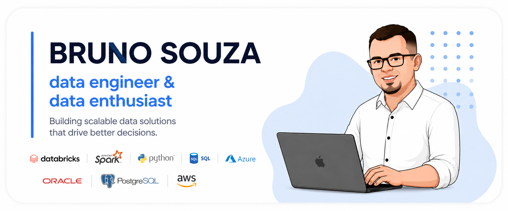

# Hi, I'm Bruno 👋 💻

  

I'm a data engineer and database specialist passionate about building scalable data platforms, analytics solutions and enterprise-grade data architectures.

My background combines solid experience in data engineering, database administration and large-scale corporate environments, working with technologies such as Databricks, PySpark, SQL, Python, Oracle, PostgreSQL, Delta Lake, Azure and AWS.

I focus on designing reliable data pipelines, analytical platforms, database solutions and modern cloud architectures that transform raw data into meaningful business insights.

I also enjoy sharing knowledge, building professional projects and continuously evolving in modern data engineering, cloud computing and database technologies.
---

# Find me around the web 🌎

- Sharing projects on [GitHub](https://github.com/brmsouza) 💻

- Sharing my professional journey on [LinkedIn](https://www.linkedin.com/in/bruno-souza-7b4b739a/) 💼

- Working on data engineering, analytics and cloud projects 🚀
